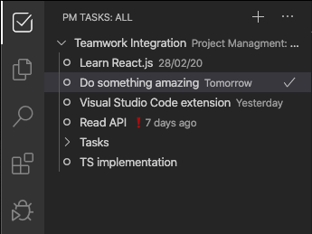
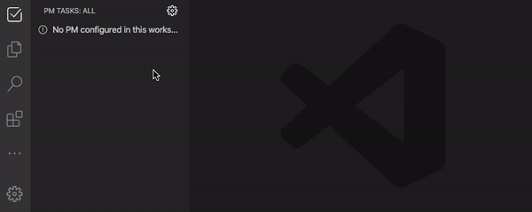

# Project Managment: Tasks

Easily manage your project tasks without quit your favorite code editor



## Works with:

- Teamwork ✔
- Monday  _`coming soon`_
- _...More PM's are coming_

## Usage

**Install and enable extension**
> You'll need an `API KEY` from your Project Manager software

Go to **PM Tasks** Panel and configure a tasklist



You can **Create, Complete and view Task Details**

## Extension Settings
Use these settings to set your tasks workflow

|Setting|Does|Default|
|---|---|---:|
|`pm.taskList`|`[Array]` [Tasklist Object](#Tasklist-Object) _Recommended usage on **Workspace**_|`null`|
|`pm.onlyMine`|Shows only tasks assigned to your user. Disable to view all tasks you have permission|`true`|
|`pm.groupTasksByProject`|Group taskslists in Project tree. Disable to view unfiltered tasks|`true`|
|`pm.nestSubTasks`|Shows parent tasks as a single element and subtasks inside them. Disable to show all tasks togheter without filters|`true`|
|`pm.sortBy`|Sort tasks by due date, created date, priority or more. ASC and DESC options|`'duedate'`|


### Providers tokens
`pm.teamworkToken`: Save in user configuration


## Tasklist Object

> This configuration can be created with `PM Tasks: Configure Project` command

```json
{
  "pm.taskList": [
    {
      "id": "1234567",
      "label": "App Mayor Refactor",
      "projectManager": "teamwork",
      "projectId": "654321",
      "projectName": "An Amazing Project"
    }
  ]
}
```

## Release Notes

Cooming:
- Add more Project Managers
- Better task details view
- `Edit tasks`

### 0.1.0

Initial release of PM Tasks Extension
- Teamwork:
  - Add Teamwork Token to Settings
  - Add Taskslist as Projects
  - List tasks (filter options)
  - Create task with responsible and due-date
  - View tasks details `ID, Title, Description, Start and Due date, Responsible`
  - Complete task

------------------------------

#### Thank you!

* Send feedback and recommendations to n@nesslopz.com ✉️
* Report [issues](https://github.com/nesslopz/PM-Tasks/issues) 🐞
* PR are welcome! 😃